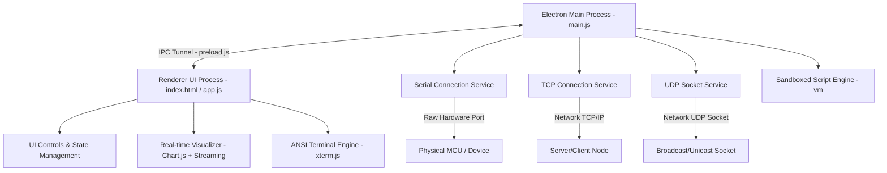

# Serial Debug Assistant Pro 🚀

[](https://electronjs.org)
[](package.json)
[](LICENSE)

Serial Debug Assistant Pro is a professional-grade desktop application engineered for hardware developers, embedded systems engineers, and network administrators. It provides a premium, high-performance interface for debugging **Serial (UART/COM)**, **TCP Client/Server**, and **UDP** communications. 

Featuring hardware-accelerated real-time waveform plotting (with multi-view splits), 600 customizable command slots, custom mathematical expression generators `f(t)`, macro shortcut binding, automated sequence lists, and a sandboxed JavaScript script engine, this application turns raw byte streams into interactive, visual diagnostics.

---

## 📖 Table of Contents

- [🛠️ Tech Stack & Architecture](#%EF%B8%8F-tech-stack--architecture)
  - [Core Platform](#core-platform)
  - [Frontend & UI Framework](#frontend--ui-framework)
  - [I/O & Communication Layer](#io--communication-layer)
  - [Runtime & Sandboxing](#runtime--sandboxing)
- [🚀 Getting Started](#-getting-started)
  - [Prerequisites](#prerequisites)
  - [Installation](#installation)
  - [Running Locally](#running-locally)
  - [Building Production Bundles](#building-production-bundles)
- [📚 Feature Wiki (Detailed Reference)](#-feature-wiki-detailed-reference)
  - [1. Connection Panel](#1-connection-panel)
  - [2. Real-Time Monitor Panel](#2-real-time-monitor-panel)
  - [3. Interactive Send Bar & History](#3-interactive-send-bar--history)
  - [4. Real-Time Waveform Visualizer](#4-real-time-waveform-visualizer)
  - [5. Split-View Waveform System](#5-split-view-waveform-system)
  - [6. Command Cards & Slots](#6-command-cards--slots)
  - [7. Repeat & f(t) Command Modes](#7-repeat--ft-command-modes)
  - [8. Keyboard Macro Hotkeys](#8-keyboard-macro-hotkeys)
  - [9. Automated Sequence Panel](#9-automated-sequence-panel)
  - [10. Sandboxed Scripting Engine](#10-sandboxed-scripting-engine)
  - [11. Math Channels](#11-math-channels)
  - [12. Interactive VT100 Terminal](#12-interactive-vt100-terminal)
  - [13. Real-Time Search & Filtering](#13-real-time-search--filtering)
  - [14. Split Panel Layout System](#14-split-panel-layout-system)
  - [15. Custom Theme Engine](#15-custom-theme-engine)
- [📊 Waveform Data Formats](#-waveform-data-formats)
- [🤖 AI Agent & Developer Extension Reference](#-ai-agent--developer-extension-reference)
  - [Codebase Structure](#codebase-structure)
  - [Extending Connection Services](#extending-connection-services)
  - [Adding Global Commands or Custom Script APIs](#adding-global-commands-or-custom-script-apis)
  - [Local State & Persistence Policies](#local-state--persistence-policies)
- [🔧 Troubleshooting & Optimization](#-troubleshooting--optimization)

---

## 🛠️ Tech Stack & Architecture

The application is built on a highly modular, decoupled architecture separating hardware-level concerns from real-time visualization controls.



### Core Platform
- **Electron (v33.0.0)**: Coordinates native shell interfaces, cross-process messaging, window state management, and packaging pipelines.
- **Node.js**: Operates the backend loop, serial device handshakes, local file systems, and network communication sockets.

### Frontend & UI Framework
- **Vanilla HTML5 & CSS3**: High-performance, pixel-perfect interface with curated theme systems, CSS custom properties, responsive split panes, and zero virtual DOM rendering overhead.
- **Chart.js (v4.4.0) + Streaming (v2.0.0) + Luxon (v3.4.0)**: Leverages HTML5 canvas acceleration to plot high-density time-series data streams (up to 500+ FPS) without blocking thread loops.
- **xterm.js (v5.5.0) + Addon-Fit (v0.10.0)**: Powers a high-performance, VT100-compatible browser terminal emulator.

### I/O & Communication Layer
- **`serialport` (v12.0.0)**: Provides programmatic interaction with hardware UART / COM ports.
- **Node.js `net` Module**: Facilitates high-performance TCP socket handshakes, client endpoints, and listening server ports.
- **Node.js `dgram` Module**: Binds UDP datagram sockets to enable low-latency broadcasts and stream listening.
- **`iconv-lite` (v0.6.3)**: Provides support for converting multi-byte encodings (e.g., UTF-8, ASCII, GBK, Latin-1) without dropping bytes.

### Runtime & Sandboxing
- **Node.js `vm` (Virtual Machine)**: Provides an isolated sandbox environment that compiles and executes custom user JavaScript automation scripts at native V8 speed, strictly separated from sensitive local desktop capabilities.

[▲ Back to Table of Contents](#%F0%9F%93%96-table-of-contents)

---

## 🚀 Getting Started

Follow these instructions to set up the development environment, execute the application, or package executable distribution bundles.

### Prerequisites
Make sure you have [Node.js](https://nodejs.org) (v18 or higher recommended) and npm installed.

### Installation
Clone the repository and install all dependencies:
```bash
npm install
```

### Running Locally
Launch the Electron development container:
```bash
npm start
```

### Building Production Bundles
Compile a standalone, optimized installer for your local platform:
```bash
npm run build
```
This triggers `electron-builder` to package assets and produce a distribution folder in `./dist/` containing an installer (e.g., `.exe` NSIS installer for Windows).

[▲ Back to Table of Contents](#%F0%9F%93%96-table-of-contents)

---

## 📚 Feature Wiki (Detailed Reference)

---

### 1. Connection Panel
The Connection Panel controls physical and logical socket bounds. It features modular adapters for Serial, TCP Client, TCP Server, and UDP.

* **Serial COM Ports**: 
  * Automatically polls system ports with manual refresh support (🔄 button).
  * Configurations: Baud rates (up to 921600+), Data Bits (5-8), Parity (None, Even, Odd, Mark, Space), Stop Bits (1, 2), and hardware/software Flow Control (RTS/CTS, XON/XOFF).
  * **Auto-Reconnect**: Monitors connection status. If a physical USB-to-UART bridge is unplugged, it retries connecting every 3 seconds, resuming the interface once reinserted.
* **TCP Client**: Connects to remote hosts and arbitrary network sockets.
* **TCP Server**: Launches a listening socket. Supports multiple incoming TCP client connections and displays all inbound payloads in the shared log monitor.
* **UDP Socket**: Binds to a local listening port while specifying a default target remote IP/port for outbound datagrams.

[▲ Back to Table of Contents](#%F0%9F%93%96-table-of-contents) | [Go to Troubleshooting](#-troubleshooting--optimization)

---

### 2. Real-Time Monitor Panel
The central log system displays inbound (RX) and outbound (TX) frames with microsecond timestamp fidelity.

* **Display Configurations**:
  * **HEX Mode**: Prints raw hexadecimal space-separated byte arrays (e.g., `48 65 6C 6C 6F`).
  * **ASCII Mode**: decodes bytes using standard textual encodings (e.g., `Hello World`).
  * **Mixed Mode**: Displays both Hexadecimal and ASCII representations side-by-side.
* **Smart Stream Controls**:
  * **Auto Frame Break**: Groups sequential bytes into unified frames based on an idle-time threshold (default: 50ms).
  * **Show Timestamp**: Prefixes incoming packets with local clock times `[HH:MM:SS.mmm]`.
  * **Monitor Pause (⏸)**: Suspends screen rendering to allow logs to be inspected. Incoming payloads are still buffered in background memory to prevent data loss. Clicking pause again displays all cached frames.
  * **Flexible Encodings**: Decodes standard text characters using **UTF-8**, **ASCII**, **GBK** (Chinese character set), or **Latin-1**.
  * **Throughput Counters**: Monitors and displays received (RX) and sent (TX) byte counts in the status bar, along with a one-click **Clear** utility.

[▲ Back to Table of Contents](#%F0%9F%93%96-table-of-contents)

---

### 3. Interactive Send Bar & History
Outbound messages can be triggered directly from the footer console.

* **Encoding Support**: Supports standard text input (**String Mode**) or raw hex sequences (**HEX Mode**, e.g., `55 AA 01 02`).
* **Format Appenders**: Options to automatically append Carriage Return (`\r` or `\r\n`) and Newline (`\n`) terminators to every command.
* **Outbound History**: Keeps track of up to 100 sent payloads. Use the **Up Arrow (↑)** and **Down Arrow (↓)** keys to navigate through sent commands.
* **Multi-Line Commands**: Supports typing multi-line messages by pressing **Shift+Enter**, while pressing **Enter** triggers immediate transmission.

[▲ Back to Table of Contents](#%F0%9F%93%96-table-of-contents)

---

### 4. Real-Time Waveform Visualizer
Plots numeric data from incoming streams in real time. It uses canvas scaling to plot high-density streams.

* **Modes of Operation**:
  * **Plotter**: Time-series charts that scroll, where the X-axis represents the data point index.
  * **Scope**: Oscilloscope display mode with configurable timebases (ms/div) and vertical grids (amplitude/div).
* **Granular Configs**:
  * **Max Points**: Defines the maximum number of data points kept in screen buffers (default: 500) to optimize performance.
  * **Interactive Legends**: Click a channel's color indicator to open the config menu. This lets you rename the channel, change the plot color, apply scale multipliers and offsets, or toggle visibility.
  * **Sample Rates**: For high-speed data streams, enable sampling (e.g., plotting only every Nth received point) to keep CPU usage low.

[▲ Back to Table of Contents](#%F0%9F%93%96-table-of-contents) | [Go to Data Formats](#-waveform-data-formats)

---

### 5. Split-View Waveform System
The application allows you to split the waveform interface to analyze separate channels side by side.

* **Dynamic Splitting**: Right-click any active chart to split the viewport **Horizontally (↔)** or **Vertically (↕)**.
* **Independent Controls**: Each split chart operates as its own view instance:
  * Has its own scale controls (**Amp/div**, **Y Offset**, **ms/div**).
  * Features an independent channel selector. Click legend dots to enable or disable specific data channels for that chart.
* **Resizing & Screenshots**:
  * Drag the vertical or horizontal split handles to change pane sizes.
  * Right-click to take high-resolution PNG screenshots of a single view or a composite of all active views.

[▲ Back to Table of Contents](#%F0%9F%93%96-table-of-contents)

---

### 6. Command Cards & Slots
The application provides **600 programmable command slots** (organized into pages of 20) for storing frequently used developer commands.

* **Command Config**: Each card contains a configurable Name, Payload, Format (Hex/String), Description, and Trigger Type.
* **LED Status indicators**: An integrated virtual LED blinker flashes green on successful command transmission.
* **JSON Import/Export**: Save the entire list of 600 slots as a single JSON file to share layouts or keep backups.

[▲ Back to Table of Contents](#%F0%9F%93%96-table-of-contents) | [Go to Macro Hotkeys](#8-keyboard-macro-hotkeys)

---

### 7. Repeat & f(t) Command Modes
Command slots can operate in advanced logical modes instead of simple single-fire actions.

* **Repeat Mode**: Transmits the command a configured number of times (or infinitely) at a custom time interval (ms). Click the card's active trigger badge to stop a running cycle.
* **Function of Time Mode `f(t)`**: Evaluates mathematical formulas in real time and sends the result over the active connection.
  * **Formula evaluation**: Evaluates expressions at custom time periods (e.g., 50ms) using elapsed seconds `t`.
  * **Data templates**: Use the `{fn}` variable in your payload data (e.g., `VAL={fn}`). The engine evaluates the formula and inserts the formatted float before sending.
  * **Math Functions**: Supports standard trigonometric, logarithmic, and absolute math formulas (e.g., `sin(t)`, `cos(t)`, `pow(x, y)`, `abs(x)`).

[▲ Back to Table of Contents](#%F0%9F%93%96-table-of-contents) | [Go to Data Formats](#-waveform-data-formats)

---

### 8. Keyboard Macro Hotkeys
Assign any of the 600 command cards to a physical keyboard key for instant execution.

* **Mapping**: Click a card's key mapper button and press any key (including Function keys F1–F12, Space, Escape, Backspace, or Arrow keys) to bind it.
* **Listener Box**: Click the central **Macro Listener** to start capturing keystrokes. While active, pressing a mapped key triggers its assigned command immediately.

[▲ Back to Table of Contents](#%F0%9F%93%96-table-of-contents)

---

### 9. Automated Sequence Panel
Enables users to build and run automated test steps.

* **Sequence Steps**: Create lists of command steps with custom payloads, data formats, and custom delays (ms) between steps.
* **Looping**: Run sequences once or loop them indefinitely to test device stability.

[▲ Back to Table of Contents](#%F0%9F%93%96-table-of-contents)

---

### 10. Sandboxed Scripting Engine
An advanced automation utility that compiles and runs custom JavaScript scripts inside a sandboxed VM.

* **Core APIs**:
  * `send(string)`: Transmits text over the active connection.
  * `sendHex(hexString)`: Sends raw binary data (e.g., `sendHex("48 65 6C 6C 6F")`).
  * `onData(function(bytes){})`: Registers a callback that receives incoming data as a byte array.
  * `log(...args)` / `console.log(...args)`: Prints values to the integrated script console.
  * `setTimeout(fn, ms)` / `setInterval(fn, ms)`: Manages timed automation events.
* **Security & Isolation**: Uses Node's `vm` engine. Scripts do not have access to the file system, network interfaces, or global process states.
* **Automatic Safeguards**: Implements a **5-second execution timeout** on the main thread compilation to prevent infinite loops from hanging the application.

[▲ Back to Table of Contents](#%F0%9F%93%96-table-of-contents) | [Go to AI Agent References](#-ai-agent--developer-extension-reference)

---

### 11. Math Channels
Create dynamic computed data channels using mathematical combinations of incoming hardware channels.

* **Computed Channels**: Define formulas using active data keys (e.g., `voltage * current` to compute dynamic power).
* **Reference Scope**: Refer to standard channels like `CH1`, `CH2` or custom labels in your formulas.
* **Automatic Plotting**: The calculated outputs are plotted on the charts alongside raw data streams.

[▲ Back to Table of Contents](#%F0%9F%93%96-table-of-contents)

---

### 12. Interactive VT100 Terminal
An interactive terminal panel built with `xterm.js`.

* **VT100 Compliance**: Supports standard terminal controls, ANSI escape sequences, color coding, and relative cursor coordinates.
* **Local Echo**: Toggle local echo to display characters locally as you type them.
* **Direct I/O**: Passes physical keystrokes straight to active ports to interact with bootloaders or CLI shells.

[▲ Back to Table of Contents](#%F0%9F%93%96-table-of-contents)

---

### 13. Real-Time Search & Filtering
Easily find specific messages in high-speed data streams.

* **Interactive Highlights**: Type search queries in the search bar to highlight matching lines and dim other entries.
* **Log Filters**: Filter logs to show only received data (RX), sent data (TX), or everything.
* **Data Agnostic**: Matches against both decoded ASCII strings and raw Hexadecimal byte characters.

[▲ Back to Table of Contents](#%F0%9F%93%96-table-of-contents)

---

### 14. Split Panel Layout System
Work with two distinct interface views side by side.

* **Layout Modes**: Open secondary tabs (such as the Waveform plotter, VT100 Terminal, or Script Runner) in a split view.
* **Adjustable Widths**: Drag the vertical partition bar to resize the viewports to your liking.

[▲ Back to Table of Contents](#%F0%9F%93%96-table-of-contents)

---

### 15. Custom Theme Engine
A theme engine that updates styling across all panels instantly.

* **Preconfigured Styles**: Includes **Midnight** (deep navy), **Cyberpunk** (neon highlights), **Forest** (dark greens), **Ocean** (blues), and **Sunset** (warm colors).
* **Dynamic Custom Themes**: Choose custom colors for backgrounds, panels, text, and active highlights.
* **Backup Configuration**: Export custom theme palettes as JSON files, or import theme configurations shared by other team members.

[▲ Back to Table of Contents](#%F0%9F%93%96-table-of-contents)

---

## 📊 Waveform Data Formats

The waveform parsing engine automatically identifies incoming formats line by line. Ensure your hardware or host stream sends data in one of these four supported formats:

### 1. Key-Value (Recommended)
```text
temperature:23.5,pressure:1013.2,humidity:65.0\n
```
* **Pros**: Automatically maps values to labels. Channels persist their configs even if sent in different orders.

### 2. Equal-Sign Variables
```text
CH1=12.4,CH2=150.3,CH3=0.012\n
```
* **Pros**: Simple, compact structure for standard microcontroller outputs.

### 3. Plain CSV (Comma-Separated Values)
```text
100,200,300\n
```
* **Pros**: Extremely low data overhead.
* **Note**: Values are assigned to default channels sequentially (`CH1`, `CH2`, `CH3`, etc.).

### 4. JSON Formatted Payloads
```json
{"temp": 23.5, "speed": 100}\n
```
* **Pros**: Easy to integrate with web servers and IoT clients.

[▲ Back to Table of Contents](#%F0%9F%93%96-table-of-contents) | [Go to Split-View Waveforms](#5-split-view-waveform-system)

---

## 🤖 AI Agent & Developer Extension Reference

This section outlines the codebase structure and provides guidance for AI coding agents (such as Antigravity) or developers extending the application.

### Codebase Structure

```text
├── main.js                 # Electron Main Process (I/O services, hardware serial, and VM runtimes)
├── preload.js              # IPC Bridge (Safely exposes backend I/O APIs to the frontend)
├── package.json            # Build pipeline scripts and package dependencies
├── src/
│   ├── index.html          # Central HTML structure and view containers
│   ├── index.css           # Styling, layout rules, and dynamic theme properties
│   ├── app.js              # Renderer process controller (UI interactions and chart loops)
│   └── services/           # Backend communication adapters
│       ├── serial-service.js     # SerialPort wrappers and event callback hooks
│       ├── tcp-service.js        # TCP Client and server listeners
│       ├── udp-service.js        # UDP bind and datagram senders
│       ├── encoding-service.js   # Character converters using iconv-lite
│       └── script-engine.js      # Runs automation scripts in isolated VM contexts
```

### Extending Connection Services
To integrate a new connection type (e.g., Bluetooth Serial, WebSocket, or CAN Bus):
1. **Create Service Module**: Add a new service adapter file under `src/services/` (e.g., `bluetooth-service.js`). The class should inherit or implement standard connection event bindings (`connect()`, `disconnect()`, `send()`, `onData()`, `onError()`, `onClosed()`).
2. **Expose IPC Bridging**: Import the new service in `main.js`, bind IPC event channels to handle data transfer, and expose secure hooks inside `preload.js`.
3. **Register UI Elements**: Add UI controls in `src/index.html` under the Connection Panel. Add a matching initialization block inside `src/app.js` to manage connection states.

### Adding Global Commands or Custom Script APIs
To provide scripts with additional capabilities (e.g., file system logging or custom utility functions):
1. Locate the sandbox configuration inside `src/services/script-engine.js` (lines 19–74).
2. To expose a new function or library, define it inside the `sandbox` object. For example, to add a base64 converter:
   ```javascript
   const sandbox = {
     // ... existing helpers
     toBase64: (str) => Buffer.from(str).toString('base64'),
   }
   ```
3. Document the new API in the [Sandboxed Scripting Engine Section](#10-sandboxed-scripting-engine) of this README so developers can find it.

### Local State & Persistence Policies
* **Storage Location**: The application stores all state parameters locally in the browser's `localStorage`.
* **State Persistence**: Configuration data is saved on the `beforeunload` event, when modifying command cards, or when updating math channels.
* **Command Backup**: When executing bulk updates, ensure you use the JSON backup mechanism or run validations to avoid corrupting user settings in `localStorage`.

[▲ Back to Table of Contents](#%F0%9F%93%96-table-of-contents)

---

## 🔧 Troubleshooting & Optimization

### COM Port Not Found
1. Make sure your device is connected to your computer.
2. Click the refresh button (🔄) on the connection panel.
3. Verify that no other application is using the target port.
4. Check your OS Device Manager to confirm your USB-to-UART drivers (e.g., CH340, CP210x, FTDI) are installed correctly.

### Waveforms Not Plotting
1. Confirm that the data sent by your device matches one of the [Supported Formats](#-waveform-data-formats).
2. Ensure you have enabled the **Waveform** switch.
3. Make sure the channels are enabled in the chart's legend (represented by filled dots).
4. Verify that the incoming byte stream uses a newline (`\n`) terminator to complete each data frame.

### CPU Usage is Too High
If the application is processing high-frequency data streams (e.g., >200Hz):
1. Enable **Data Sampling** in the plotter settings to process only every Nth data point.
2. Lower the **Max Points** setting to reduce the history buffer size.
3. Close any split views that are not currently needed.
4. Minimize the scrollback buffer size in the `xterm.js` configuration.

### Settings Don't Save
* The application writes settings to `localStorage`. Avoid forcing the application to close unexpectedly (e.g., killing the process via Task Manager), as this can bypass the auto-save sequence triggered during the `beforeunload` event.

---

*Serial Debug Assistant Pro — Engineered for speed, visibility, and automation.*
