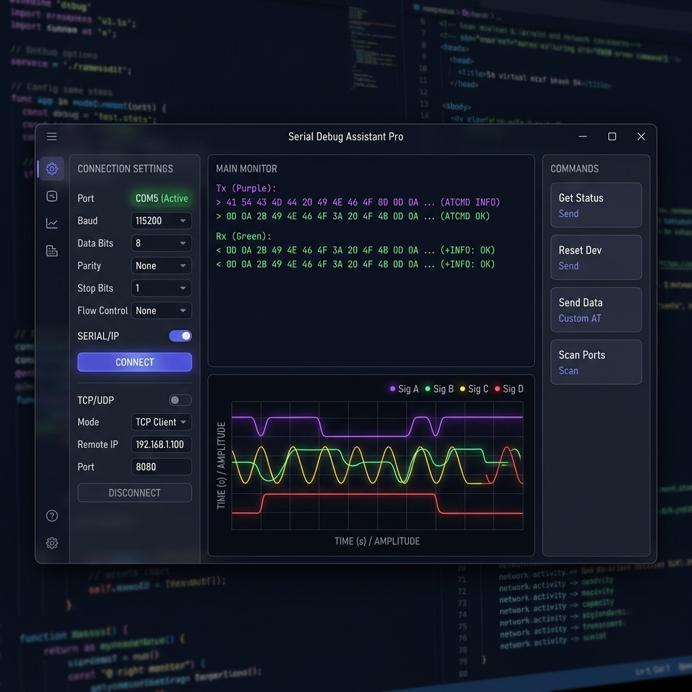
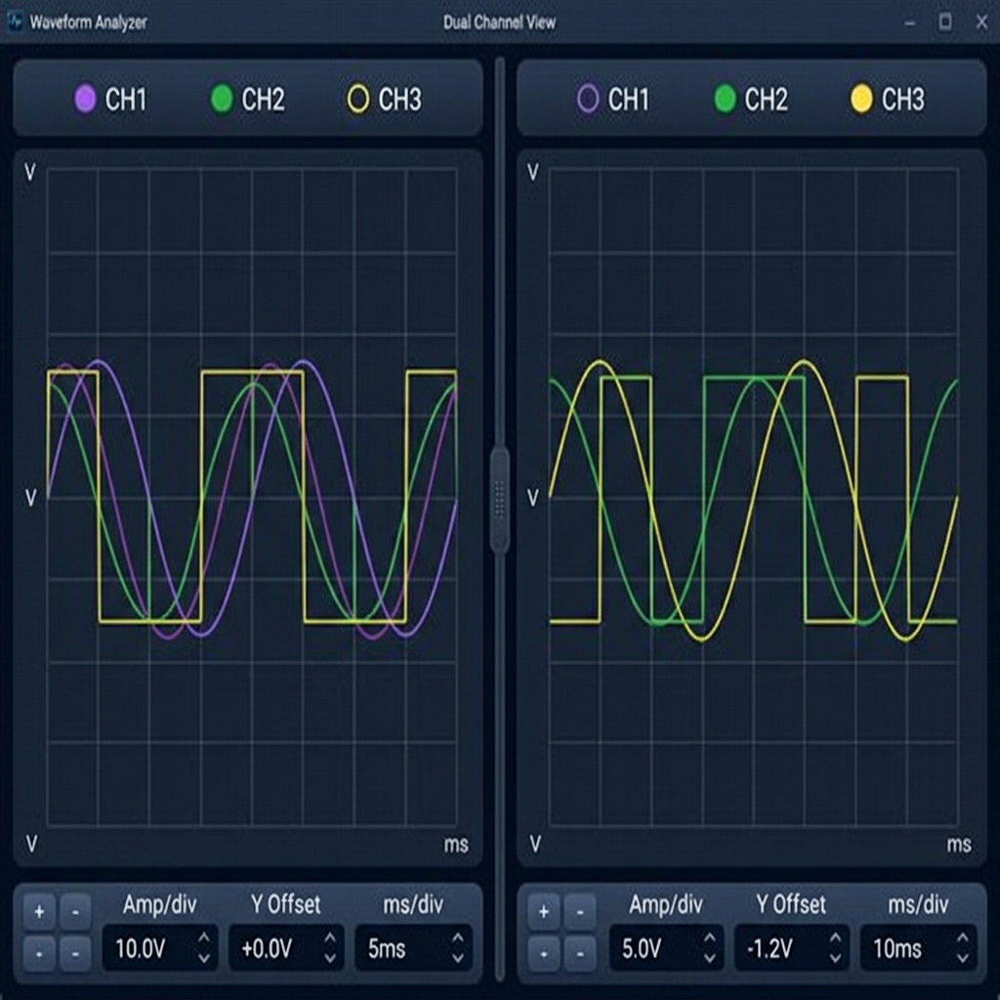
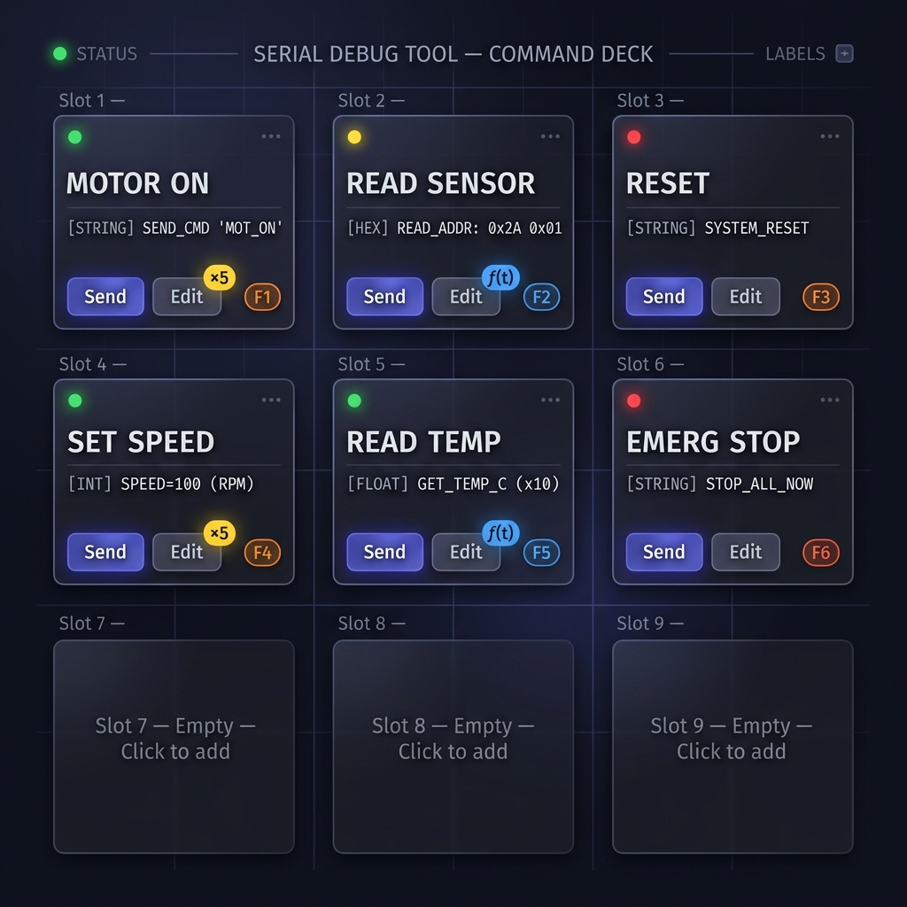

# Serial Debug Assistant Pro — User Guide



## Table of Contents

1. [Overview](#overview)
2. [Getting Started](#getting-started)
3. [Connection Panel](#connection-panel)
4. [Monitor Panel](#monitor-panel)
5. [Send Bar](#send-bar)
6. [Waveform Visualizer](#waveform-visualizer)
7. [Split-View Waveform](#split-view-waveform)
8. [Command Cards](#command-cards)
9. [Command Modes (Single / Repeat / Function)](#command-modes)
10. [Macro Keys](#macro-keys)
11. [Sequence Panel](#sequence-panel)
12. [Script Engine](#script-engine)
13. [Math Channels](#math-channels)
14. [Terminal Panel](#terminal-panel)
15. [Search & Filter](#search--filter)
16. [Split Panel Layout](#split-panel-layout)
17. [Theme Customization](#theme-customization)
18. [Settings](#settings)
19. [Data Export & Import](#data-export--import)
20. [Keyboard Shortcuts](#keyboard-shortcuts)
21. [Waveform Data Format](#waveform-data-format)
22. [Troubleshooting](#troubleshooting)

---

## Overview

Serial Debug Assistant Pro is a professional-grade desktop tool for debugging serial (UART), TCP, and UDP communication. Built with Electron, it provides:

- **Multi-protocol support** — Serial (COM ports), TCP Client/Server, UDP
- **Real-time data monitor** — Hex, ASCII, and mixed display modes
- **Waveform visualization** — Real-time plotting with split-view, per-channel controls
- **600 command slots** — With repeat mode, function-of-time scripting, and macro hotkeys
- **Script engine** — Write JavaScript to automate send/receive logic
- **Math channels** — Create computed channels from expressions
- **Full state persistence** — All settings saved and restored across sessions

---

## Getting Started

### Installation

```bash
# Install dependencies
npm install

# Run the application
npm start

# Build distributable
npm run dist
```

### First Launch

1. The app opens with the **Connection Panel** in the sidebar (left)
2. Select your connection type: **Serial**, **TCP Client**, **TCP Server**, or **UDP**
3. Configure connection parameters (baud rate, port, etc.)
4. Click **Connect**
5. Data appears in the **Monitor** panel automatically

---

## Connection Panel

### Serial (UART)

| Setting | Description | Default |
|---------|-------------|---------|
| **Port** | COM port dropdown (auto-refreshes) | — |
| **Baud Rate** | Communication speed | 115200 |
| **Data Bits** | 5, 6, 7, or 8 | 8 |
| **Parity** | None, Even, Odd, Mark, Space | None |
| **Stop Bits** | 1 or 2 | 1 |
| **Flow Control** | None, RTS/CTS, XON/XOFF | None |

Click 🔄 to refresh the port list at any time.

### TCP Client

| Setting | Description | Default |
|---------|-------------|---------|
| **Host** | IP address or hostname | 127.0.0.1 |
| **Port** | TCP port number | 8080 |

### TCP Server

| Setting | Description | Default |
|---------|-------------|---------|
| **Port** | Port to listen on | 8080 |

When a client connects, a toast notification appears. All data from connected clients is shown in the monitor.

### UDP

| Setting | Description | Default |
|---------|-------------|---------|
| **Local Port** | Port to bind/listen on | 8081 |
| **Remote Host** | Target IP for sending | 127.0.0.1 |
| **Remote Port** | Target port for sending | 8082 |

### Auto-Reconnect

Enable the **Auto-Reconnect** checkbox to automatically reconnect if the connection drops (serial only). The app retries every 3 seconds.

---

## Monitor Panel

The monitor displays all incoming (RX) and outgoing (TX) data.

### Display Modes

| Mode | Description |
|------|-------------|
| **HEX** | Shows raw bytes as hexadecimal: `48 65 6C 6C 6F` |
| **ASCII** | Shows decoded text: `Hello World` |
| **Mixed** | Shows both hex and ASCII side by side |

### Frame Breaking

Enable **Auto Frame Break** to group incoming bytes into frames based on a configurable time gap (default: 50ms). When enabled, consecutive bytes arriving within the gap are grouped into a single frame.

### Timestamps

Toggle **Show Timestamp** to prefix each frame with the receive time: `[14:30:05.123]`

### Monitor Pause

Click the **⏸ Pause** button (or the pause icon) to freeze the monitor display without stopping data collection. Data continues to be captured in the background. Click again to resume and see all buffered data.

### Encoding

| Encoding | Use Case |
|----------|----------|
| **UTF-8** | Standard text (default) |
| **ASCII** | 7-bit ASCII |
| **GBK** | Chinese character encoding |
| **Latin-1** | Western European |

### RX/TX Counters

The status bar shows live byte counters for received (RX) and transmitted (TX) data. Click **Clear** to reset both counters and clear the monitor.

---

## Send Bar

The send bar at the bottom of the monitor allows you to transmit data.

### Send Modes

| Mode | Description | Example |
|------|-------------|---------|
| **String** | Send as plain text | `Hello World` |
| **HEX** | Send as hex bytes | `48 65 6C 6C 6F` |

### Options

- **\\n (Newline)** — Append `\n` to every send
- **\\r (Carriage Return)** — Append `\r` to every send
- **Auto-Repeat** — Send the same data repeatedly at a configurable interval (ms)

### Send History

Press **↑** / **↓** arrow keys in the send input to scroll through previously sent commands. The history stores up to 100 entries.

> **Tip:** Multi-line input is supported. Press **Shift+Enter** for a new line, **Enter** to send.

---

## Waveform Visualizer

The waveform panel plots numeric data from your serial stream in real-time.

### Enabling

Click the **Waveform** tab in the navigation. Enable the waveform toggle to start capturing plot data.

### Data Format

Your device must send data in one of these formats:

```
# Format 1: Key-Value pairs (recommended)
temperature:23.5,pressure:1013.2,humidity:65.0

# Format 2: Labeled values
CH1=100,CH2=200,CH3=300

# Format 3: Plain CSV (auto-labeled as CH1, CH2, etc.)
100,200,300

# Format 4: JSON-like
{"temp":23.5,"speed":100}
```

Each line of data creates one data point on the chart.

### Modes

| Mode | Description |
|------|-------------|
| **Plotter** | Time-series scrolling chart, X-axis = data point index |
| **Scope** | Oscilloscope-style, X-axis = time (ms/div), Y-axis = amplitude/div |

### Plotter Controls

| Control | Description |
|---------|-------------|
| **Max Points** | Maximum data points to keep on screen (default: 500) |
| **Data Rate** | Expected data rate in ms between samples |

### Scope Controls (per-view)

| Control | Description | Default |
|---------|-------------|---------|
| **Amp/div** (Y) | Vertical scale — amplitude per grid division | 5 |
| **Y Offset** | Vertical position shift | 0 |
| **ms/div** (T) | Horizontal time scale — milliseconds per division | 50 |

Use the **+/−** buttons or type values directly in the input fields.

### Channel Legend

Each detected channel appears in the global legend bar with its color. Click the color dot to open the **Channel Config** panel where you can:

- Rename channels (custom label)
- Change colors
- Set scale multiplier and offset
- Toggle visibility
- Choose display mode (Channel Number / Data Label / Custom Name)

### Data Sampling

For high-frequency data streams, enable **Data Sampling** and set the sample rate (e.g., every 2nd, 5th, or 10th point) to reduce CPU load.

---

## Split-View Waveform



The split-view feature lets you create multiple independent waveform charts for comparing different channels.

### Creating Splits

1. **Right-click** on any waveform chart
2. Select **Split Horizontal ↔** or **Split Vertical ↕**
3. A new chart appears alongside the original

### Per-View Controls

Each split view has its own:

- **Legend bar** — Shows ALL available channels as colored dots
  - **Filled dot** = channel enabled (data shown)
  - **Hollow dot** = channel disabled (click to enable)
  - The original (first) view: all channels enabled by default
  - New views: all channels **disabled** by default — click dots to enable
- **Scale bar** — Independent Amp/div, Y-offset, and ms/div controls
- **Chart instance** — Fully independent rendering

### Managing Views

- **Click** a view to make it active (highlighted with accent border)
- **Drag** the resizer handle between views to adjust sizes
- **Right-click → Close View** to remove a split (cannot close the last view)
- **Right-click → Screenshot** to capture the current view or all views

### Example Workflow

1. Connect to a device sending `temperature:25.3,pressure:1013,motor_rpm:1500`
2. The main view shows all 3 channels
3. Right-click → Split Horizontal
4. In the new view, enable only `motor_rpm` by clicking its dot
5. Adjust the new view's Amp/div to match RPM scale (e.g., 500/div)
6. Now you have temperature+pressure in one chart and motor RPM in another

---

## Command Cards



The command panel provides **600 programmable slots** for storing and sending commands.

### Creating a Command

1. Click an empty slot or click **Edit** on an existing one
2. Fill in:
   - **Name** — Display name (e.g., "Motor ON")
   - **Data** — The payload to send (e.g., `SET_MOTOR 1`)
   - **Format** — String or HEX
   - **Notes** — Optional description
3. Choose the **send mode** (see [Command Modes](#command-modes))
4. Click **Save**

### Sending

- Click **Send** on the card
- Or use an assigned [Macro Key](#macro-keys)
- The LED indicator blinks green on send

### Pagination

Use the **◀ ▶** arrows at the top of the command panel to navigate between pages. The page info shows `1-20 of 600`.

### Import / Export

- **Export** — Saves all 600 command slots as a JSON file
- **Import** — Loads commands from a previously exported JSON file

---

## Command Modes

Each command slot can operate in one of three modes:

### 1. Single Mode (Default)

Sends the command data once when clicked. No badge shown on the card.

### 2. Repeat Mode

Sends the command N times at a configurable interval.

| Setting | Description | Default |
|---------|-------------|---------|
| **Repeat Count** | Number of times to send | 5 |
| **Interval (ms)** | Delay between each send | 500 |

A **×5** badge appears on the card. Click **Send** to start the repeat sequence. Click **Send** again while running to **stop** it.

### 3. Function of Time Mode `f(t)`

Sends a dynamically computed value that changes over time, based on a mathematical expression.

| Setting | Description | Default |
|---------|-------------|---------|
| **Expression** | Math expression using `t` (seconds) | `sin(t)` |
| **Rate (ms)** | How often to evaluate and send | 100 |
| **Duration (s)** | How long to run | 5 |
| **Decimal Places** | Number formatting | 2 |

An **f(t)** badge appears on the card.

#### How It Works

1. When you press **Send**, a timer starts
2. Every `rate` ms, the expression is evaluated with `t` = elapsed seconds
3. The computed value is sent over the connection
4. After `duration` seconds, it stops automatically

#### Data Template

If the command's **Data** field contains `{fn}`, the computed value replaces it:

| Data Field | Expression | At t=1.5s | Sent String |
|------------|------------|-----------|-------------|
| `{fn}` | `sin(t)` | 0.997 | `1.00` |
| `SET_SPEED {fn}` | `t * 100` | 150 | `SET_SPEED 150.00` |
| _(empty)_ | `sin(t) * 255` | 254.7 | `254.70` |

#### Available Functions

| Function | Description | Example |
|----------|-------------|---------|
| `sin(t)` | Sine | `sin(2 * PI * t)` |
| `cos(t)` | Cosine | `cos(t)` |
| `tan(t)` | Tangent | `tan(t)` |
| `abs(x)` | Absolute value | `abs(sin(t))` |
| `sqrt(x)` | Square root | `sqrt(t)` |
| `log(x)` | Natural log | `log(t + 1)` |
| `pow(x, y)` | Power | `pow(t, 2)` |
| `min(a, b)` | Minimum | `min(t, 5)` |
| `max(a, b)` | Maximum | `max(0, sin(t))` |
| `round(x)` | Round | `round(sin(t) * 100)` |
| `floor(x)` | Floor | `floor(t)` |
| `ceil(x)` | Ceiling | `ceil(t * 10)` |
| `PI` | π (3.14159...) | `sin(2 * PI * t)` |
| `E` | Euler's number | `pow(E, -t)` |

#### Example Expressions

| Expression | Description |
|------------|-------------|
| `sin(2 * PI * t)` | 1 Hz sine wave |
| `sin(2 * PI * t) * 127 + 128` | Sine wave scaled to 0-255 (PWM) |
| `t < 2 ? 0 : 255` | Step function at t=2s |
| `(t % 1) * 255` | Sawtooth wave, 1 Hz |
| `sin(t) * cos(t * 0.5) * 100` | Modulated wave |
| `pow(E, -t * 0.5) * sin(2 * PI * t) * 100` | Damped oscillation |
| `t * 10` | Linear ramp (10 units/sec) |

---

## Macro Keys

Assign keyboard shortcuts to any command slot for instant triggering.

### Assigning a Macro

1. Click the **key badge** (shows `—` if unassigned) on a command card
2. Press any key on your keyboard
3. The key appears as a badge (e.g., `F1`, `A`, `↑`, `␣ Space`)
4. Press **Escape** to remove an existing macro

### Using Macros

1. Click the **Macro Listener** box at the top of the command panel
2. The box shows "Listening for keystrokes..."
3. Press any assigned macro key
4. The corresponding command sends immediately with an LED blink

### Special Key Display

| Key | Displayed As |
|-----|-------------|
| Space | `␣ Space` |
| Enter | `↵ Enter` |
| Tab | `⇥ Tab` |
| Escape | `⎋ Esc` |
| Backspace | `⌫ Bksp` |
| Delete | `⌦ Del` |
| Arrow Up | `↑` |
| Arrow Down | `↓` |
| Arrow Left | `←` |
| Arrow Right | `→` |
| F1–F12 | `F1` – `F12` |

---

## Sequence Panel

The sequence panel lets you send a series of commands with configurable delays.

### Creating a Sequence

1. Switch to the **Sequences** tab
2. Click **Add Step**
3. For each step, configure:
   - **Data** — The string or hex to send
   - **Delay (ms)** — Wait time before sending this step
   - **Format** — String or HEX

### Running

- Click **▶ Run** to start the sequence
- Enable **Loop** to repeat the sequence continuously
- Click **■ Stop** to halt execution

### Default Delay

Set the **Default Delay** value to pre-fill new steps with a common delay.

---

## Script Engine

The script panel provides a full JavaScript scripting environment for automating complex send/receive scenarios.

### Editor

Type your script in the code editor (supports Tab indentation). Click **▶ Run** to execute, **■ Stop** to halt.

### Available API

#### `send(data)`
Send a string over the active connection.

```javascript
send("Hello World\n");
send("AT+GMR\r\n");
```

#### `sendHex(hexString)`
Send raw hex bytes.

```javascript
sendHex("48 65 6C 6C 6F");  // Sends "Hello"
sendHex("FF01020304");       // Sends 5 raw bytes
```

#### `onData(handler)`
Register a callback that fires whenever data is received.

```javascript
onData(function(data) {
  log("Received:", data);
  // data is an array of byte values
  var text = data.map(b => String.fromCharCode(b)).join('');
  log("As text:", text);
});
```

#### `log(...args)`
Print messages to the script console.

```javascript
log("Temperature:", 23.5, "°C");
log({ key: "value" });  // Objects are JSON-serialized
```

#### `console.log(...args)`
Same as `log()` — for familiarity.

```javascript
console.log("Debug info:", someVariable);
```

#### `setTimeout(fn, ms)`
Execute a function after a delay.

```javascript
setTimeout(function() {
  send("DELAYED_COMMAND\n");
}, 2000);
```

#### `setInterval(fn, ms)`
Execute a function repeatedly at an interval.

```javascript
var count = 0;
setInterval(function() {
  send("PING " + count + "\n");
  count++;
}, 1000);
```

#### `clearTimeout(id)` / `clearInterval(id)`
Cancel a pending timer.

```javascript
var timer = setInterval(function() { send("PING\n"); }, 1000);
setTimeout(function() { clearInterval(timer); log("Stopped pinging"); }, 10000);
```

#### Built-in Objects

| Object | Description |
|--------|-------------|
| `Math` | Full Math object (sin, cos, random, etc.) |
| `Date` | Date constructor and methods |
| `JSON` | JSON.parse and JSON.stringify |
| `String` | String constructor |
| `Number` | Number constructor |
| `Array` | Array constructor and methods |
| `parseInt` | Parse integer from string |
| `parseFloat` | Parse float from string |
| `isNaN` | Check if value is NaN |
| `isFinite` | Check if value is finite |
| `Buffer.from()` | Create byte arrays |
| `Buffer.alloc()` | Create zero-filled byte arrays |

### Example Scripts

#### 1. Auto-Response (Echo with Modification)

```javascript
log("Auto-responder started");

onData(function(data) {
  var text = data.map(b => String.fromCharCode(b)).join('').trim();
  if (text === "PING") {
    send("PONG\n");
    log("Replied PONG to PING");
  }
});
```

#### 2. Periodic Sensor Poll

```javascript
var pollCount = 0;
var timer = setInterval(function() {
  send("READ_SENSOR\n");
  pollCount++;
  log("Poll #" + pollCount);
  
  if (pollCount >= 100) {
    clearInterval(timer);
    log("Polling complete");
  }
}, 500);
```

#### 3. Protocol Test Sequence

```javascript
log("Starting AT command test...");

send("AT\r\n");
setTimeout(function() {
  send("AT+GMR\r\n");
}, 1000);
setTimeout(function() {
  send("AT+CWMODE=1\r\n");
}, 2000);
setTimeout(function() {
  send("AT+CWLAP\r\n");
  log("Scan initiated");
}, 3000);
```

#### 4. Data Parser

```javascript
var buffer = "";

onData(function(data) {
  buffer += data.map(b => String.fromCharCode(b)).join('');
  
  var lines = buffer.split("\n");
  buffer = lines.pop();  // Keep incomplete line
  
  lines.forEach(function(line) {
    line = line.trim();
    if (line.startsWith("TEMP:")) {
      var temp = parseFloat(line.substring(5));
      log("Temperature: " + temp + "°C");
      if (temp > 50) {
        send("ALERT_HIGH_TEMP\n");
        log("⚠ HIGH TEMP ALERT!");
      }
    }
  });
});
```

#### 5. Binary Protocol

```javascript
// Send a binary packet: [0xAA, 0x55, CMD, LEN, DATA..., CHECKSUM]
function sendPacket(cmd, payload) {
  var bytes = [0xAA, 0x55, cmd, payload.length];
  bytes = bytes.concat(payload);
  
  // Calculate checksum (XOR)
  var checksum = 0;
  for (var i = 0; i < bytes.length; i++) {
    checksum ^= bytes[i];
  }
  bytes.push(checksum);
  
  var hex = bytes.map(b => b.toString(16).padStart(2, '0')).join('');
  sendHex(hex);
  log("Sent packet: CMD=0x" + cmd.toString(16) + " LEN=" + payload.length);
}

sendPacket(0x01, [0x00, 0x64]);  // Command 1, data [0, 100]
```

### Script Console

The console at the bottom of the script panel shows all `log()` output and error messages. Click **Clear Console** to reset it. Up to 1000 log entries are retained.

### Important Notes

- Scripts run in a **sandboxed environment** (Node.js `vm` module) — they cannot access the filesystem or network directly
- Scripts have a **5-second startup timeout** — long-running logic should use `setInterval`/`setTimeout`
- Clicking **Stop** cancels all active timers and clears data handlers
- Scripts can only send data through `send()` and `sendHex()` — all data goes through the active connection

---

## Math Channels

Create computed channels from mathematical expressions applied to incoming data.

### Creating a Math Channel

1. Open the **Math Channels** section (in waveform panel toolbar)
2. Click **+ Add Math Channel**
3. Configure:
   - **Name** — Channel label (e.g., "Power")
   - **Expression** — Formula using channel names (e.g., `voltage * current`)
   - **Color** — Plot color

### Expression Variables

In math channel expressions, you can reference any active data channel by its name. For example, if your device sends `voltage:12.5,current:2.1`:

| Expression | Result |
|------------|--------|
| `voltage * current` | 26.25 (power) |
| `(CH1 + CH2) / 2` | Average of CH1 and CH2 |
| `abs(CH1 - CH2)` | Absolute difference |
| `sin(t * 0.1) * CH1` | Modulated channel |

The same math functions from [Command Modes](#available-functions) are available: `sin`, `cos`, `abs`, `sqrt`, `log`, `pow`, `min`, `max`, `round`, `floor`, `ceil`, `PI`, `E`.

### Managing

- **Edit** (✎) — Modify expression or color
- **Delete** (✕) — Remove the channel
- Math channels persist across sessions via localStorage

---

## Terminal Panel

The terminal panel provides a raw interactive terminal (xterm.js) for direct text I/O.

### Features

- Full VT100/ANSI escape code support
- Configurable local echo (toggle **Echo** checkbox)
- Keyboard input sent directly to the connection
- Color and cursor positioning support

### Usage

Switch to the **Terminal** tab. Characters you type are sent immediately. Enable **Echo** to see your typed characters locally.

---

## Search & Filter

### Monitor Search

1. Click the **🔍 Search** icon in the monitor toolbar
2. Type a search query
3. Matching frames are highlighted; non-matching frames are dimmed
4. Toggle **RX** / **TX** filters to show only received or sent data

### Search Behavior

- Search is case-insensitive
- Matches against both raw hex and decoded text
- Results update in real-time as new data arrives

---

## Split Panel Layout

Run two panels side-by-side for efficient debugging.

### Enabling

1. Select a panel from the **Split** dropdown (e.g., "Waveform", "Terminal")
2. The selected panel appears in the right pane
3. Drag the **divider** between panes to resize

### Disabling

Select **None** from the split dropdown, or click the split button again to toggle off.

---

## Theme Customization

### Built-in Presets

| Theme | Style |
|-------|-------|
| **Midnight** | Deep navy/black (default) |
| **Cyberpunk** | Neon pink/purple |
| **Forest** | Dark green tones |
| **Ocean** | Deep blue |
| **Sunset** | Warm orange/red |

### Custom Colors

1. Open **Settings → Theme**
2. Select a preset or customize individual colors:
   - Background, Surface, Accent, Text colors
3. Click **Apply**

### Custom Theme Save/Load

- **Save** — Store your custom palette with a name
- **Load** — Apply a previously saved custom theme
- **Export/Import** — Share themes as JSON files

---

## Settings

### Font Size

| Setting | Description | Default |
|---------|-------------|---------|
| **UI Font Size** | General interface text | 13px |
| **Mono Font Size** | Monitor/terminal monospace text | 12px |

### Performance

| Setting | Description |
|---------|-------------|
| **Data Sampling** | Skip every Nth data point for waveform (reduces CPU) |
| **Sample Rate** | Process every 2nd, 5th, 10th point, etc. |

### Data Rate Monitor

The status bar shows the current data throughput. A warning toast appears if the incoming rate exceeds the processing capacity.

---

## Data Export & Import

### Monitor Data

- **Export Log** — Save the monitor contents as a text file
- **Clear** — Reset the monitor and byte counters

### Waveform Screenshot

- **Right-click → Screenshot View** — Capture the current chart as PNG
- **Right-click → Screenshot All Views** — Capture all split views as a composite image

### Commands

- **Export Commands** — Save all 600 slots as JSON
- **Import Commands** — Load commands from JSON file

---

## Keyboard Shortcuts

| Shortcut | Action |
|----------|--------|
| **Enter** | Send data from send bar |
| **Shift+Enter** | New line in send bar |
| **↑ / ↓** | Navigate send history |
| **Tab** (in script editor) | Insert 2 spaces |
| **Macro keys** (in listener box) | Trigger assigned commands |

---

## Waveform Data Format

### Supported Input Formats

The parser auto-detects the format from each line:

#### Key-Value (Recommended)
```
temperature:23.5,pressure:1013.2,humidity:65.0
```

#### Equals-Separated
```
CH1=100,CH2=200,CH3=300
```

#### Plain CSV
```
100,200,300
```
Auto-labeled as `CH1`, `CH2`, `CH3`.

#### JSON
```
{"temp":23.5,"speed":100}
```

### Label Modes

| Mode | Display |
|------|---------|
| **Channel Number** | CH1, CH2, CH3 |
| **Data Label** | Uses the key from key-value pairs |
| **Custom** | User-defined name in channel config |

### Channel Offline Detection

If a channel stops sending data for 3+ seconds, it's marked as **OFFLINE** with a dimmed legend indicator.

---

## Troubleshooting

### "Cannot read properties of undefined"

This typically means a stale reference in the code. Restart the app to clear state.

### COM Port Not Showing

1. Check that the device is plugged in
2. Click the **🔄 Refresh** button
3. Ensure no other application is using the port
4. Check Device Manager for driver issues

### Waveform Not Plotting

1. Verify your device sends data in a supported format (see [Data Format](#waveform-data-format))
2. Ensure the **Waveform** toggle is enabled
3. Check that channels are **enabled** in the per-view legend (filled dots)
4. Try switching between Plotter and Scope modes

### High CPU Usage

1. Enable **Data Sampling** (skip every 2nd+ point)
2. Reduce **Max Points** in plotter settings
3. Close unnecessary split views
4. Reduce the data send rate from your device

### Settings Not Saving

All settings are stored in `localStorage`. If settings don't persist:
1. Ensure the app closes normally (not force-killed)
2. Check that the disk isn't full
3. The app saves state on `beforeunload` and when editing commands

---

*Serial Debug Assistant Pro — Built with Electron, Chart.js, and xterm.js*
